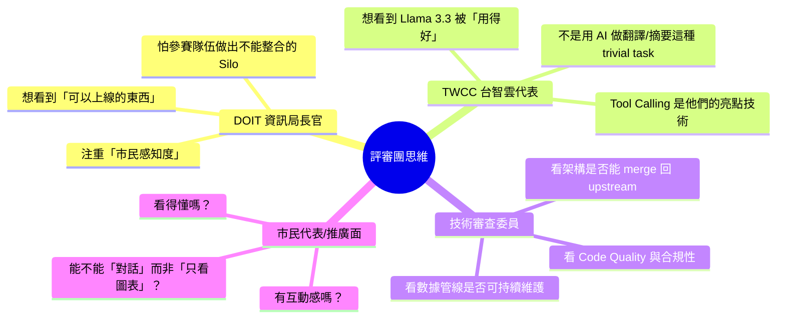

# 🎯 CIVIC NEXUS 2026 — 逆向工程官方思維與 AI Agent 制勝策略

## 一、官方 Code Style 規範整理

### 前端規範（[官方原始來源](https://raw.githubusercontent.com/taipei-doit/Taipei-City-Dashboard-Documentation/main/src/assets/articles/front-end-ch/code-style.md)）

| 項目 | 官方要求 | 備註 |
|------|----------|------|
| **Linter** | Prettier + ESLint（`.eslintrc.json` + `.prettierrc` **禁止修改**） | PR 前必跑 `npm run lint` |
| **Vue 組件命名** | Pascal Case，至少兩個單字（`MapView`） | |
| **函式命名** | Camel Case，以動詞開頭（`handleSubmit`） | |
| **變量命名** | Camel Case，**禁止 `var`** | |
| **CSS Class** | Kebab Case，根類 = 組件名全小寫（`SettingsBar` → `.settingsbar`），子類以根類為前綴（`.settingsbar-title`） | |
| **組件結構** | `<script setup>` → `<template>` → `<style scoped lang="scss">` | 官方用 **SCSS**，不是純 CSS |
| **CSS 屬性排序** | Dimensions → Display → Position → Margin/Padding → Border → Background → Font → Animation → Transition → Other | 嚴格順序 |
| **Selector 位置** | 放在 class 主要樣式之後 | |

### 後端規範（[官方原始來源](https://raw.githubusercontent.com/taipei-doit/Taipei-City-Dashboard-Documentation/main/src/assets/articles/back-end-ch/code-style.md)）

| 項目 | 官方要求 | 備註 |
|------|----------|------|
| **Linter** | `gopls`（VS Code 自動包含，`.vscode` 設定**禁止修改**） | |
| **資料夾命名** | 小寫單字（`db`） | Go package 規範 |
| **檔案命名** | 小寫，多字用 Camel Case（`componentConfig.go`） | |
| **匯出符號** | Pascal Case（`GetAllComponents`） | |
| **內部符號** | Camel Case（`createTempComponentDB`） | |
| **Import 順序** | 1) 標準庫 → 2) 內部套件 → 3) 第三方套件 | |
| **文件結構** | Package → Import → Global Vars/Structs → Functions | |

> [!IMPORTANT]
> 我們先前生成的 `frontend_code_style.md` 寫了 **Vanilla CSS**，但官方實際使用 **SCSS** (`<style scoped lang="scss">`)。需要修正。

---

## 二、逆向工程官方思維 — 「他們到底想要什麼？」

### 2.1 官方使用者畫像 (Judge Persona)



### 2.2 核心盲點分析

> [!CAUTION]
> **官方的「真正痛點」不是技術，是「橋樑」**——儀表板做得再漂亮，如果民眾不會用、不想用，就是失敗。

| 盲點層級 | 描述 | 官方暗示的線索 |
|----------|------|----------------|
| 🔴 **數據 → 民眾落差** | 儀表板是「給公務員看的」，民眾不知道它存在，也看不懂 | 官方強調「讓臺北城市儀表板，成為**您的**儀表板」，3.0 擴充到「雙北」就是要觸及更多人 |
| 🔴 **AI = 花瓶** | 給了 LLM API + Tool Calling，但官方自己只實作了 `get_current_time` 和 `get_population_summary` 兩個 demo tool | 這是故意的——他們想看「你們能把這個骨架做到多豐富」 |
| 🟡 **防災已是藍海** | 官方直接說了「防災已經做很多了」 | 意味著他們不想再看到「又一個避難所地圖」，他們想看到**差異化** |
| 🟡 **互動性 = 0** | 現有儀表板是**純展示型**（圖表 + 地圖），沒有任何對話式互動 | AI Chat 是唯一的互動入口，但目前只有骨架 |
| 🟢 **推廣 = 空白** | 沒有任何推廣相關的功能設計（沒有分享、沒有嵌入、沒有民眾友善的 UX） | 這是最大的未填空白 |

### 2.3 官方「真正想抓到的核心」

```
官方想看到的不是「10 個漂亮的圖表」
而是「1 個讓民眾願意主動使用的入口」

                    ┌──────────────────────────────┐
                    │   民眾推廣 + AI 互動性 = ?    │
                    │                              │
                    │   答案：AI 導覽員（Concierge） │
                    │   不是 Chatbot，是「城市探索夥伴」│
                    └──────────────────────────────┘
```

---

## 三、AI Agent 在框架內的「合法最大化」策略

### 3.1 框架限制的精確邊界

```
┌─────────────────────────────────────────────┐
│  你能做的（合法邊界內）                       │
│                                             │
│  ✅ 在 registry.go 註冊無限多 Go Tool        │
│  ✅ Tool 可以查詢 PostgreSQL 任何表           │
│  ✅ Tool 可以呼叫外部 API（data.taipei 等）   │
│  ✅ 前端可以自訂 system instruction           │
│  ✅ 前端可以動態傳入不同的 tools 定義         │
│  ✅ 串流模式讓對話體驗像 ChatGPT              │
│  ✅ session_id 維持對話上下文                  │
│  ✅ 5 輪 tool calling = 可以做 multi-step     │
│                                             │
│  ❌ 前端不能直接呼叫 TWCC                     │
│  ❌ 不能用其他 LLM                            │
│  ❌ 不能裝未核准套件                           │
└─────────────────────────────────────────────┘
```

### 3.2 制勝 AI 策略：「城市導覽員」模式

> 不是做 Chatbot，是做 **「數據導覽員 (Data Concierge)」**

#### 核心理念
把 AI 從「你問我答」升級成「我主動帶你探索城市」。

#### 具體實作方式（全部合法）

| AI 行為 | 實作方式 | 對應 Tool |
|---------|---------|-----------|
| 🗣️ **主題導覽** | 用戶選擇主題（文化/食安/防災），AI 自動串聯 3-4 個 Tool 做「故事線」 | 多 Tool 串聯（5 輪夠用） |
| 📊 **圖表解說** | 用戶點擊任何組件 → AI 自動解釋「這個數據代表什麼」 | `query_*` tools + system instruction |
| 🔍 **跨組件洞察** | 「台北 AED 密度 vs 老年人口分佈有什麼關聯？」→ AI 同時調用兩個 Tool 做交叉分析 | 2 tools in 1 session |
| 🎯 **個人化建議** | 「我住信義區，附近有哪些文化設施？」→ AI 調用地理查詢 Tool | `query_cultural_facilities` + 參數化 |
| 📣 **推廣文案** | AI 把數據洞察轉化為「社群媒體可分享的文字」 | 純 LLM 生成，不需 Tool |

#### 使用者旅程設計

```
民眾打開儀表板
    │
    ▼
  看到 AI 導覽入口（不是冷冰冰的 Chat Icon，
  而是「探索你的城市 🏙️」按鈕）
    │
    ▼
  選擇主題：「我想了解食安」
    │
    ▼
  AI（自動 multi-tool）：
  「台北市 2024 年食品稽查合格率為 96.2%，
   但信義區的夜市攤販複查率偏低...
   要不要看看具體的趨勢圖？」
    │                              
    ▼                              
  [動態渲染 ApexChart]              
  AI 繼續：「根據死因統計，                 
  食源性疾病佔比持續下降，                  
  這和稽查頻率提升有正相關...」              
    │
    ▼
  用戶：「那新北市呢？」
    │
    ▼
  AI（session 保持上下文）：
  調用 tool 比較雙城數據
    │
    ▼
  用戶：「幫我生成一段可以分享的摘要」
    │
    ▼
  AI 輸出「社群友善格式」的數據故事
```

### 3.3 必須新增的 Tool（建議優先級）

| 優先級 | Tool Name | 功能 | 為何重要 |
|--------|-----------|------|----------|
| 🔥 P0 | `query_component_insight` | 給定組件 index，回傳該組件的統計數據 + 描述 + 建議使用案例 | **這是讓 AI 能「解說」任何組件的核心** |
| 🔥 P0 | `compare_dual_city` | 比較台北 vs 新北同類數據 | **雙城對比是 3.0 的核心賣點** |
| 🔴 P1 | `query_nearby_facilities` | 根據行政區/座標查詢附近設施 | **個人化體驗** |
| 🔴 P1 | `generate_data_story` | 將多個 Tool 結果組織成「故事」 | **推廣核心** |
| 🟡 P2 | `query_historical_trend` | 查詢某指標的歷史趨勢（時間序列） | 深度分析 |

---

## 四、評分制勝矩陣

| 評分維度（推測） | 多數隊伍會做 | 我們應該做 | 為何是制勝點 |
|-----------------|-------------|-----------|-------------|
| **技術完整度** | 10 個獨立圖表組件 | 7 個圖表 + AI 串聯敘事 | 評審看的是「整合度」不是「數量」 |
| **AI 應用深度** | 用 AI 做 Q&A | 用 AI 做「數據導覽」+ 跨組件洞察 | 展現 Tool Calling 的真正價值 |
| **民眾推廣** | 漂亮 UI | AI 生成可分享內容 + 對話式探索 | 直擊官方「橋樑」痛點 |
| **雙城整合** | 各自獨立的台北/新北頁面 | AI 自動做雙城對比分析 | 這是 3.0 的靈魂 |
| **可維護性** | 硬編碼數據 | 走標準 component config + query_charts 路線 | 可 merge 回 upstream |

---

## 五、行動建議（今晚可以做的事）

### 立即行動
1. **修正 `frontend_code_style.md`**：把 Vanilla CSS 改為 SCSS（與官方一致）
2. **設計 AI 導覽員的 system instruction**：寫一份精煉的 persona prompt，讓 Llama 3.3 扮演「台北城市數據導覽員」
3. **規劃 `query_component_insight` Tool**：這是 AI 能「看懂」儀表板的基礎

### 短期衝刺（Demo 前）
4. **實作「主題導覽」流程**：用戶選主題 → AI 自動串聯 3 個 Tool → 輸出故事線
5. **前端 Chat UI 升級**：從「聊天框」變成「探索面板」，嵌入組件 card

### 差異化殺手鐧
6. **「分享我的城市發現」功能**：AI 把洞察打包成一段適合社群的文字 + 截圖
7. **「雙城 PK」模式**：一鍵比較台北 vs 新北同類指標

---

> [!TIP]
> **記住官方的潛台詞**：「防災是藍海」= 大家都做了，沒有差異化。「民眾推廣 + AI 互動」= 這才是今年的**紅海中的藍海**。把 AI 從「工程師的玩具」變成「民眾的城市探索夥伴」，就是這次比賽的核心勝負手。
