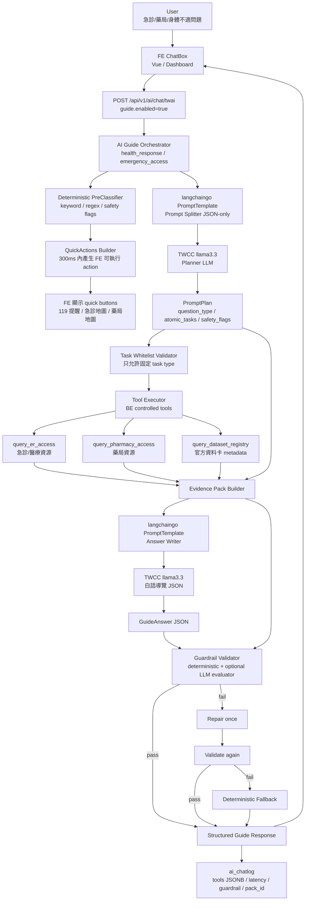
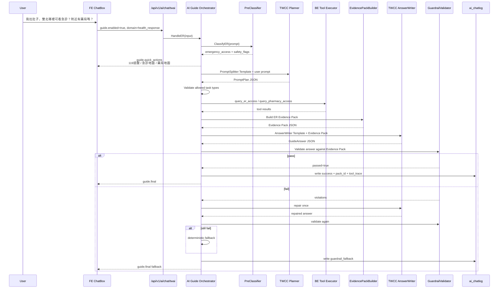
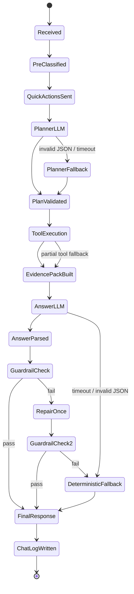

# 急診案例版 AI Guide Orchestrator Spec

TL;DR：可以整合 langchaingo，但不要讓模型自主 agent 化；急診案例應採「BE Orchestrator 控制流程 + langchaingo PromptTemplate/Tool interface/LLM client」架構，讓 TWCC LLM 只做語意拆解與白話導覽，不做醫療診斷、不做即時急重症判斷、不直接控制前端。

現有系統已經使用 TWCC `llama3.3-ffm-70b-16k-chat`、`langchaingo`、Streaming、Tool Calling、Semaphore、`ai_chatlog`，因此新功能應接回既有 `/api/v1/ai/chat/twai`，不是另起一套 AI gateway。Evidence Pack 的定位是「AI 回答前由 BE 組出的可機器讀取證據包」，包含官方資料卡、計算事實、資料限制、可跳轉元件、AI 可說/不可說規則。原產品主線是「AI 把市民焦慮轉成官方資料查證路徑」，急診案例只是把 domain 從食安查證轉成「健康應變可及性導覽」。

langchaingo 可採「選擇性導入」：只用 `llms`、`prompts`、`tools`、必要時用 `chains`，不用完整 autonomous agent。LangChainGo 文件本身也強調不必採用整個框架，可依需求只用 LLM client、prompt templating、memory、agents/tools/chains 等元件。Prompt templates 支援可重用、參數化 prompt，且 Go template 是 Go app 的建議格式。Tool interface 在 langchaingo 中是 `Name() / Description() / Call(ctx,input)`，可直接對應 BE internal tools。

---

## 0. 急診案例定位

### 使用者情境

```text
使用者看到食安新聞或身體不舒服
→ 問 AI：「我拉肚子、嘔吐，有點擔心，雙北哪裡可以看急診？附近有藥局嗎？」
→ 系統不能診斷
→ 系統先提示嚴重症狀應直接 119 / 就醫
→ BE 查急診 / 醫療院所 / 藥局 / 服務可及性資料
→ 組 Evidence Pack
→ LLM 轉成白話導覽
→ FE 顯示急診資源、藥局資源、資料限制、快速按鈕
```

### AI 可以做

```text
分類使用者問題
拆成原子任務
推薦急診 / 藥局 / 醫療資源可及性元件
說明官方資料能查什麼
說明資料限制
提示緊急情況應直接撥打 119 或前往急診
```

### AI 不可以做

```text
不可診斷是否食物中毒
不可判斷使用者是否需要急診
不可建議吃什麼藥
不可判斷哪家醫院一定最快
不可保證急診等待時間、床位、藥局營業狀態即時正確
不可用資料不足推論「安全」或「沒問題」
```

---

---

# 2. BE Spec：langchaingo 整合版，急診案例

## 2.1 設計結論

使用 langchaingo，但只用三個核心：

```text
prompts：PromptTemplate / ChatPromptTemplate，用於 splitter、answer writer、evaluator
llms：沿用既有 TWCC provider adapter
tools：讓 BE internal tools 具備標準 Name / Description / Call 介面
chains：可選；v0 建議不用 autonomous chain，先用 Orchestrator 明確控制每一步
```

不要採用：

```text
不要讓 LLM 自主選 tool
不要讓 LLM 自主決定急診排序
不要讓 LLM 直接產生地圖資料
不要讓 LLM 直接輸出醫療建議
不要讓 LLM 直接回 FE
```

---

## 2.2 Endpoint

沿用既有：

```http
POST /api/v1/ai/chat/twai
```

Request 新增 guide mode：

```json
{
  "session": "session_er_demo_001",
  "stream": true,
  "messages": [
    {
      "role": "user",
      "content": "我吃完餐廳後一直拉肚子，想知道雙北哪裡可以看急診？附近有藥局嗎？"
    }
  ],
  "temperature": 0.2,
  "top_p": 0.8,
  "top_k": 40,
  "max_new_tokens": 700,
  "seed": 42,
  "guide": {
    "enabled": true,
    "domain": "health_response",
    "scenario": "emergency_access",
    "return_evidence_pack": true,
    "return_quick_actions": true,
    "component_registry_version": "v0"
  }
}
```

---

## 2.3 Response Contract

```json
{
  "status": "success",
  "data": {
    "session": "session_er_demo_001",
    "provider": "twcc",
    "model": "llama3.3-ffm-70b-16k-chat",
    "mode": "ai_guide",
    "domain": "health_response",
    "question_type": "emergency_access",
    "content": "若有緊急或持續惡化狀況，請直接撥打 119 或前往急診。根據目前可登錄的官方或公開資料，本系統可協助查詢雙北急診與藥局資源位置，但不提供診斷或用藥建議。",
    "answer": {
      "summary": "若有緊急或持續惡化狀況，請直接撥打 119 或前往急診。根據目前可登錄的官方或公開資料，本系統可協助查詢雙北急診與藥局資源位置，但不提供診斷或用藥建議。",
      "emergency_warning": "若出現意識不清、呼吸困難、胸痛、嚴重脫水、持續惡化或其他緊急狀況，請立即撥打 119 或直接前往急診。",
      "recommended_component_ids": [
        "emergency_action_card",
        "er_access_map",
        "pharmacy_access_map"
      ],
      "limitations": [
        "本系統不提供醫療診斷、治療或用藥建議。",
        "急診等待時間、空床與藥局營業狀態需以現場或主管機關公告為準。"
      ],
      "evidence_card_ids": [
        "card_er_facility_registry",
        "card_pharmacy_registry"
      ],
      "quick_action_ids": [
        "qa_show_119_warning",
        "qa_show_er_map",
        "qa_show_pharmacy_map"
      ]
    },
    "quick_actions": [
      {
        "id": "qa_show_119_warning",
        "label": "查看緊急狀況提醒",
        "priority": 1,
        "action": {
          "type": "show_static_card",
          "card": "emergency_warning"
        }
      },
      {
        "id": "qa_show_er_map",
        "label": "查看急診與醫療資源地圖",
        "priority": 2,
        "action": {
          "type": "navigate_focus_component",
          "path": "/dashboard",
          "query": {
            "index": "health_response",
            "focusComponent": "er_access_map"
          }
        }
      },
      {
        "id": "qa_show_pharmacy_map",
        "label": "查看藥局資源地圖",
        "priority": 3,
        "action": {
          "type": "navigate_focus_component",
          "path": "/dashboard",
          "query": {
            "index": "health_response",
            "focusComponent": "pharmacy_access_map"
          }
        }
      }
    ],
    "evidence_pack": {
      "pack_id": "ep_er_access_demo_001",
      "version": "0.1"
    },
    "guardrail": {
      "passed": true,
      "violations": [],
      "fallback": false
    },
    "usage": {
      "input_tokens": 0,
      "output_tokens": 0,
      "total_tokens": 0
    },
    "latency_ms": 0
  }
}
```

---

## 2.4 SSE Streaming Contract

急診案例 streaming 必須先出 quick actions，不等 LLM。

```text
event: guide.status
data: {"stage":"received","message":"已收到問題"}

event: guide.quick_actions
data: {"actions":[...]}

event: guide.status
data: {"stage":"safety_prefilter","message":"正在檢查是否需要緊急提醒"}

event: guide.status
data: {"stage":"evidence_pack","message":"正在整理急診與藥局資源資料"}

event: guide.delta
data: {"content":"若有緊急或持續惡化狀況，"}

event: guide.delta
data: {"content":"請直接撥打 119 或前往急診。"}

event: guide.final
data: {"answer":{...},"evidence_pack":{...},"guardrail":{"passed":true}}
```

Timeout 規則：

```text
quick_actions_deadline_ms = 300
llm_soft_timeout_ms = 6000
llm_hard_timeout_ms = min(TWCC_TIMEOUT, 30000)
```

Fallback：

```json
{
  "summary": "若有緊急或持續惡化狀況，請直接撥打 119 或前往急診。目前先提供急診與藥局資源導覽。本系統不提供醫療診斷、治療或用藥建議。",
  "emergency_warning": "若出現意識不清、呼吸困難、胸痛、嚴重脫水、持續惡化或其他緊急狀況，請立即撥打 119 或直接前往急診。",
  "recommended_component_ids": [
    "emergency_action_card",
    "er_access_map",
    "pharmacy_access_map"
  ],
  "limitations": [
    "本系統不提供醫療診斷、治療或用藥建議。",
    "急診等待時間與藥局營業狀態需以現場或主管機關公告為準。"
  ],
  "evidence_card_ids": [
    "card_er_facility_registry",
    "card_pharmacy_registry"
  ],
  "quick_action_ids": [
    "qa_show_119_warning",
    "qa_show_er_map",
    "qa_show_pharmacy_map"
  ]
}
```

---

## 2.5 Component Registry：急診版

```json
{
  "version": "v0",
  "domain": "health_response",
  "components": [
    {
      "component_id": "emergency_action_card",
      "title": "緊急狀況提醒",
      "question_types": [
        "urgent_symptom_warning",
        "medical_diagnosis_request",
        "medical_decision_request",
        "emergency_access"
      ],
      "keywords": ["昏倒", "呼吸困難", "胸痛", "嚴重脫水", "一直吐", "意識不清", "119"],
      "action": {
        "type": "show_static_card",
        "card": "emergency_warning"
      }
    },
    {
      "component_id": "er_access_map",
      "title": "急診與醫療資源地圖",
      "question_types": [
        "emergency_access",
        "urgent_symptom_warning",
        "er_wait_time_or_ranking_request",
        "medical_diagnosis_request"
      ],
      "keywords": ["急診", "醫院", "就醫", "拉肚子", "嘔吐", "不舒服"],
      "action": {
        "type": "navigate_focus_component",
        "path": "/dashboard",
        "query": {
          "index": "health_response",
          "focusComponent": "er_access_map"
        }
      }
    },
    {
      "component_id": "pharmacy_access_map",
      "title": "藥局資源地圖",
      "question_types": [
        "pharmacy_access",
        "emergency_access"
      ],
      "keywords": ["藥局", "附近藥局", "領藥", "健保藥局"],
      "action": {
        "type": "navigate_focus_component",
        "path": "/dashboard",
        "query": {
          "index": "health_response",
          "focusComponent": "pharmacy_access_map"
        }
      }
    },
    {
      "component_id": "medical_disclaimer_card",
      "title": "醫療資訊限制",
      "question_types": [
        "emergency_access",
        "urgent_symptom_warning",
        "pharmacy_access",
        "medical_diagnosis_request",
        "medical_decision_request"
      ],
      "keywords": ["診斷", "吃藥", "治療", "需不需要去醫院"],
      "action": {
        "type": "show_static_card",
        "card": "medical_disclaimer"
      }
    },
    {
      "component_id": "info_gap_radar",
      "title": "健康應變資訊落差雷達",
      "question_types": [
        "er_wait_time_or_ranking_request",
        "info_gap"
      ],
      "keywords": ["最快", "排名", "等待時間", "即時", "空床", "資料限制"],
      "action": {
        "type": "navigate_focus_component",
        "path": "/dashboard",
        "query": {
          "index": "health_response",
          "focusComponent": "info_gap_radar"
        }
      }
    }
  ]
}
```

---

## 2.6 Go Package 切分

```text
app/services/ai/guide/
  types.go
  service.go
  pre_classifier.go
  planner.go
  prompt_templates.go
  component_registry.go
  evidence_pack.go
  tools.go
  answer_writer.go
  evaluator.go
  validator.go
  fallback.go
```

---

## 2.7 Type 定義

```go
package guide

type GuideConfig struct {
	Enabled                 bool   `json:"enabled"`
	Domain                  string `json:"domain"`
	Scenario                string `json:"scenario"`
	ReturnEvidencePack       bool   `json:"return_evidence_pack"`
	ReturnQuickActions       bool   `json:"return_quick_actions"`
	ComponentRegistryVersion string `json:"component_registry_version"`
}

type PromptPlan struct {
	QuestionType       string       `json:"question_type"`
	Confidence         float64      `json:"confidence"`
	Language           string       `json:"language"`
	Entities           Entities     `json:"entities"`
	SafetyFlags         []string     `json:"safety_flags"`
	AtomicTasks         []AtomicTask `json:"atomic_tasks"`
	RequiredLimitations []string     `json:"required_limitations"`
}

type Entities struct {
	Cities           []string  `json:"cities"`
	Districts        []string  `json:"districts"`
	SymptomKeywords  []string  `json:"symptom_keywords"`
	ResourceKeywords []string  `json:"resource_keywords"`
	TimeRange        TimeRange `json:"time_range"`
}

type TimeRange struct {
	Type  string  `json:"type"`
	Value *string `json:"value"`
}

type AtomicTask struct {
	TaskID    string                 `json:"task_id"`
	Type      string                 `json:"type"`
	Args      map[string]interface{} `json:"args"`
	DependsOn []string               `json:"depends_on"`
	Status    string                 `json:"status,omitempty"`
}

type GuideAnswer struct {
	Summary                 string   `json:"summary"`
	EmergencyWarning        string   `json:"emergency_warning"`
	RecommendedComponentIDs []string `json:"recommended_component_ids"`
	Limitations             []string `json:"limitations"`
	EvidenceCardIDs          []string `json:"evidence_card_ids"`
	QuickActionIDs           []string `json:"quick_action_ids"`
}

type GuardrailResult struct {
	Passed     bool     `json:"passed"`
	Violations []string `json:"violations"`
	Fallback   bool     `json:"fallback"`
	Reason     string   `json:"reason,omitempty"`
}
```

---

## 2.8 langchaingo PromptTemplate 實作概念

```go
package guide

import (
	"encoding/json"
	"fmt"

	"github.com/tmc/langchaingo/prompts"
)

var ERPromptSplitterTemplate = prompts.PromptTemplate{
	Template: `
你是 AI 急診導覽員的 Prompt Splitter。你的任務是把使用者問題拆成後端可執行的原子任務。

限制：
1. 只輸出 JSON，不要輸出 Markdown。
2. 不得回答使用者問題。
3. 不得診斷疾病。
4. 不得提供用藥、治療、是否就醫的個人化建議。
5. 不得排序哪間醫院最好、最快、最安全。
6. 若使用者描述嚴重症狀，必須加入 show_119_warning。
7. 不得產生白名單以外的 task type 或 question_type。

允許的 question_type：
- emergency_access
- urgent_symptom_warning
- pharmacy_access
- er_wait_time_or_ranking_request
- medical_diagnosis_request
- medical_decision_request
- info_gap
- out_of_scope

允許的 task type：
- classify_question
- select_component_candidates
- query_dataset_registry
- query_er_access
- query_pharmacy_access
- build_evidence_pack
- write_guided_answer
- evaluate_answer

輸出 JSON schema：
{
  "question_type": "string",
  "confidence": number,
  "language": "zh-TW",
  "entities": {
    "cities": ["taipei" | "new_taipei"],
    "districts": ["string"],
    "symptom_keywords": ["string"],
    "resource_keywords": ["er" | "hospital" | "pharmacy"],
    "time_range": {
      "type": "unspecified" | "relative" | "absolute",
      "value": "string | null"
    }
  },
  "safety_flags": ["string"],
  "atomic_tasks": [
    {
      "task_id": "string",
      "type": "string",
      "args": {},
      "depends_on": ["string"]
    }
  ],
  "required_limitations": ["string"]
}

使用者問題：
{{ .UserPrompt }}
`,
	InputVariables: []string{"UserPrompt"},
	TemplateFormat: prompts.TemplateFormatGoTemplate,
}

func BuildERPromptSplitterPrompt(userPrompt string) (string, error) {
	return ERPromptSplitterTemplate.Format(map[string]any{
		"UserPrompt": userPrompt,
	})
}

func ParsePromptPlan(raw string) (PromptPlan, error) {
	var plan PromptPlan
	if err := json.Unmarshal([]byte(raw), &plan); err != nil {
		return PromptPlan{}, fmt.Errorf("parse prompt plan json: %w", err)
	}
	return plan, nil
}
```

---

## 2.9 langchaingo Tool Interface 包裝 BE internal tools

```go
package guide

import (
	"context"
	"encoding/json"
	"fmt"
)

type ERAccessArgs struct {
	Cities    []string `json:"cities"`
	Districts []string `json:"districts"`
}

type ERAccessTool struct {
	repo MedicalResourceRepository
}

func (t ERAccessTool) Name() string {
	return "query_er_access"
}

func (t ERAccessTool) Description() string {
	return "查詢雙北急診或醫療資源登錄資料。只回傳資源導覽資料，不回傳醫療診斷、醫院排名或等待時間保證。"
}

func (t ERAccessTool) Call(ctx context.Context, input string) (string, error) {
	var args ERAccessArgs
	if err := json.Unmarshal([]byte(input), &args); err != nil {
		return "", fmt.Errorf("parse query_er_access args: %w", err)
	}

	result, err := t.repo.FindEmergencyResources(ctx, args.Cities, args.Districts)
	if err != nil {
		return "", err
	}

	out, err := json.Marshal(result)
	if err != nil {
		return "", err
	}
	return string(out), nil
}
```

重點：

```text
1. Tool 可以符合 langchaingo interface。
2. 但 v0 不讓 LLM 自主呼叫。
3. Orchestrator 依照 AtomicTask 白名單主動執行 Tool。
4. Tool result 轉成 Evidence Pack，再餵給 AnswerWriter。
```

---

## 2.10 Orchestrator 主流程 Sample Code

```go
package guide

import (
	"context"
	"time"
)

type GuideService struct {
	PreClassifier    *PreClassifier
	Planner          *Planner
	Registry         *ComponentRegistry
	ToolExecutor     *ToolExecutor
	EvidenceBuilder  *EvidencePackBuilder
	AnswerWriter     *AnswerWriter
	Validator        *Validator
	Fallback         *FallbackBuilder
	ChatLog          *ChatLogWriter
}

func (s *GuideService) HandleER(ctx context.Context, input AIChatInput) (*GuideResponse, error) {
	start := time.Now()
	userPrompt := ExtractLastUserMessage(input.Messages)

	prePlan := s.PreClassifier.ClassifyER(userPrompt)

	quickActions := s.Registry.BuildQuickActions(prePlan)
	// Streaming mode: quick_actions 應立即送出，不等 LLM。

	plan, err := s.Planner.SplitER(ctx, userPrompt, prePlan)
	if err != nil || !IsAllowedPlan(plan) {
		plan = prePlan.ToPromptPlan()
	}

	components := s.Registry.Select(plan.QuestionType, plan.Entities)

	toolResults, err := s.ToolExecutor.Execute(ctx, plan.AtomicTasks, components)
	if err != nil {
		toolResults = ToolResults{Fallback: true, Reason: err.Error()}
	}

	pack := s.EvidenceBuilder.BuildER(userPrompt, plan, components, toolResults)

	answer, err := s.AnswerWriter.WriteER(ctx, userPrompt, pack)
	if err != nil {
		answer = s.Fallback.ERAnswer(pack)
		guardrail := GuardrailResult{
			Passed:   true,
			Fallback: true,
			Reason:   "ANSWER_WRITER_ERROR",
		}
		resp := BuildGuideResponse(input, plan, pack, answer, quickActions, guardrail, time.Since(start))
		_ = s.ChatLog.WriteGuide(ctx, input, resp)
		return resp, nil
	}

	guardrail := s.Validator.ValidateER(answer, pack, s.Registry)
	if !guardrail.Passed {
		repaired, repairErr := s.AnswerWriter.RepairER(ctx, userPrompt, pack, answer, guardrail)
		if repairErr == nil {
			answer = repaired
		}

		guardrail = s.Validator.ValidateER(answer, pack, s.Registry)
		if !guardrail.Passed {
			answer = s.Fallback.ERAnswer(pack)
			guardrail = GuardrailResult{
				Passed:   true,
				Fallback: true,
				Reason:   "GUARDRAIL_FALLBACK",
			}
		}
	}

	resp := BuildGuideResponse(input, plan, pack, answer, quickActions, guardrail, time.Since(start))
	_ = s.ChatLog.WriteGuide(ctx, input, resp)

	return resp, nil
}
```

---

## 2.11 Deterministic Validator

```go
package guide

import (
	"strings"
)

func (v *Validator) ValidateER(answer GuideAnswer, pack EvidencePack, registry ComponentRegistry) GuardrailResult {
	violations := []string{}

	if strings.TrimSpace(answer.Summary) == "" {
		violations = append(violations, "EMPTY_SUMMARY")
	}

	if pack.EmergencyWarning.Show && strings.TrimSpace(answer.EmergencyWarning) == "" {
		violations = append(violations, "MISSING_EMERGENCY_WARNING")
	}

	if len(answer.Limitations) == 0 {
		violations = append(violations, "MISSING_LIMITATIONS")
	}

	for _, id := range answer.EvidenceCardIDs {
		if !pack.HasEvidenceCard(id) {
			violations = append(violations, "UNKNOWN_EVIDENCE_CARD_ID:"+id)
		}
	}

	for _, id := range answer.RecommendedComponentIDs {
		if !pack.HasComponentLink(id) && !registry.HasComponent(id) {
			violations = append(violations, "UNKNOWN_COMPONENT_ID:"+id)
		}
	}

	text := answer.Summary + " " + answer.EmergencyWarning + " " + strings.Join(answer.Limitations, " ")

	diagnosisPatterns := []string{
		"你是食物中毒",
		"應該是食物中毒",
		"判斷你是",
		"診斷為",
		"不用看醫生",
		"不需要急診",
	}

	medicationPatterns := []string{
		"你可以先吃",
		"建議吃",
		"服用",
		"止瀉藥",
		"抗生素",
		"自行用藥",
	}

	rankingPatterns := []string{
		"最快",
		"最好",
		"一定有床",
		"一定有開",
		"保證",
		"排名第一",
	}

	for _, p := range diagnosisPatterns {
		if strings.Contains(text, p) {
			violations = append(violations, "FORBIDDEN_MEDICAL_DIAGNOSIS:"+p)
		}
	}

	for _, p := range medicationPatterns {
		if strings.Contains(text, p) {
			violations = append(violations, "FORBIDDEN_MEDICATION_ADVICE:"+p)
		}
	}

	for _, p := range rankingPatterns {
		if strings.Contains(text, p) {
			violations = append(violations, "FORBIDDEN_RANKING_OR_GUARANTEE:"+p)
		}
	}

	return GuardrailResult{
		Passed:     len(violations) == 0,
		Violations: violations,
		Fallback:   false,
	}
}
```

---

## 2.12 ai_chatlog tools JSONB

現有系統已經有 `ai_chatlog`，欄位包含 session、provider、model、question、answer、tool_used、tools、token、latency、status、error 等。急診 guide mode 建議寫入：

```json
{
  "guide_mode": true,
  "domain": "health_response",
  "scenario": "emergency_access",
  "question_type": "emergency_access",
  "planner": {
    "source": "llm_with_deterministic_fallback",
    "confidence": 0.84,
    "atomic_tasks": [
      "classify_question",
      "select_component_candidates",
      "query_er_access",
      "query_pharmacy_access",
      "build_evidence_pack",
      "write_guided_answer",
      "evaluate_answer"
    ]
  },
  "evidence_pack": {
    "pack_id": "ep_er_access_demo_001",
    "evidence_card_ids": [
      "card_er_facility_registry",
      "card_pharmacy_registry"
    ],
    "component_ids": [
      "emergency_action_card",
      "er_access_map",
      "pharmacy_access_map",
      "medical_disclaimer_card"
    ]
  },
  "guardrail": {
    "passed": true,
    "violations": [],
    "fallback": false
  },
  "latency_breakdown_ms": {
    "pre_classifier": 3,
    "planner_llm": 850,
    "tool_executor": 35,
    "evidence_pack": 8,
    "answer_llm": 1700,
    "validator": 2
  },
  "quick_actions_sent_before_llm": true
}
```

---

## 2.13 最小實作順序

```text
1. ComponentRegistry：先建 emergency_action_card、er_access_map、pharmacy_access_map、medical_disclaimer_card。
2. PreClassifier：先用 keyword/regex，不等 LLM。
3. QuickActionsBuilder：300ms 內可回。
4. EvidencePackBuilder：先用 fixture / mock registry。
5. PromptTemplates：用 langchaingo prompts.PromptTemplate。
6. AnswerWriter：接既有 TWCC LLM adapter。
7. Validator：先 deterministic，LLM evaluator 第二階段。
8. ChatLog：寫 tools JSONB。
9. Streaming：先送 guide.quick_actions，再送 guide.final。
10. Golden tests：跑 PM 提供的 prompt_cases、guardrail_cases、snapshot。
```

---

# 3. AI Guide Orchestrator 架構圖與流程圖

## 3.1 架構圖



---

## 3.2 急診案例流程圖



---

## 3.3 Orchestrator 狀態機



---

## 3.4 模組責任表

| 模組                     | 責任                           |       是否使用 LLM | 是否可 fallback |
| ---------------------- | ---------------------------- | -------------: | -----------: |
| PreClassifier          | 急診 / 藥局 / 診斷請求 / 排名請求分類      |              否 |            是 |
| QuickActionsBuilder    | 先產生 FE 可點按鈕                  |              否 |            是 |
| PromptSplitter         | 產生 structured PromptPlan     |              是 |            是 |
| TaskWhitelistValidator | 檢查 task type / question type |              否 |            是 |
| ToolExecutor           | 執行 BE internal tools         |              否 |            是 |
| EvidencePackBuilder    | 組官方資料卡與限制                    |              否 |            是 |
| AnswerWriter           | 把 Evidence Pack 轉白話 JSON     |              是 |            是 |
| GuardrailValidator     | 禁止診斷、用藥、排序、保證                | 否，LLM optional |            是 |
| ChatLogWriter          | 寫入 ai_chatlog                |              否 |            否 |

---

## 3.5 最小可 demo 版本

```text
必做：
PreClassifier
QuickActionsBuilder
ComponentRegistry
EvidencePack fixture
AnswerWriter PromptTemplate
Deterministic Validator
Fallback Answer
ai_chatlog tools JSONB

可延後：
LLM Planner
LLM Evaluator
真正急診即時 API
真正藥局營業時間
地理距離排序
多輪 memory
```

急診案例的核心不是「AI 幫使用者判斷要不要去急診」，而是「AI 把身體不適焦慮導向安全的官方資源查詢路徑」。
